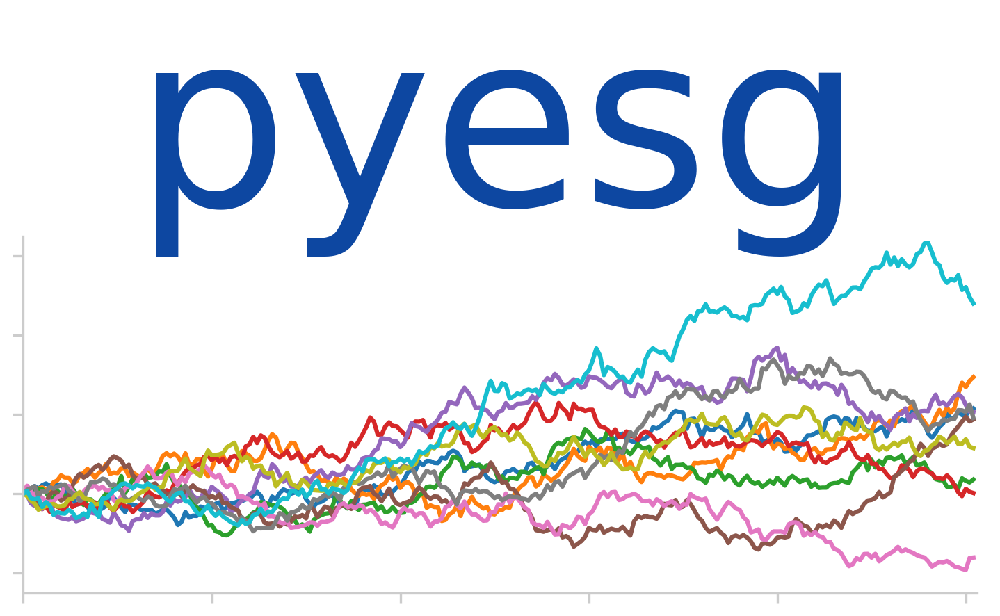

<p align="center">
  
</p>
<p align="center">
  <em>Simulate stocks, interest rates, and other stochastic processes.<br><strong>pyesg</strong> is a lightning fast economic scenario generator for Python.</em>
</p>

<p align="center">
  <a href="https://github.com/tterb/atomic-design-ui/blob/master/LICENSEs" target="_blank">
    
  </a>
  <a href="https://pypi.python.org/pypi/pyesg/" target="_blank">
    
  </a>
  <a href="https://badge.fury.io/py/pyesg" target="_blank">
    
  </a>
  <a href="https://circleci.com/gh/jason-ash/pyesg" target="_blank">
    
  </a>
  <a href="https://coveralls.io/github/jason-ash/pyesg?branch=master" target="_blank">
    
  </a>
</p>

---

### What is an economic scenario generator?

An economic scenario generator simulates the behavior of unpredictable financial markets like stocks, interest rates, or energy prices. It uses mathematical models called _stochastic processes_ to generate thousands of unique scenarios.

What can you do with an economic scenario generator? Here are a few examples:

<details>
  <summary><strong>Simulate an investment portfolio</strong></summary>

  * Generate 1,000 correlated, daily stock prices
  * Construct a portfolio from the stocks
  * Plot the value of the portfolio over time, and calculate metrics like high, low, max drawdown, etc.

</details>
<details>
  <summary><strong>Choose a mortgage</strong></summary>

  * Generate 1,000 30-year, monthly scenarios of mortgage rates
  * Calculate the monthly payment for different loans under each scenario:
    - 30-year fixed (lock in the rate today for all 30 years)
    - 15-year fixed (lock in the rate today and pay over 15 years)
    - 10-year adjustable-rate (fixed rate for 10 years, then variable rate for 20 years
    - etc.
  * Determine which loan fits the best with your budget

</details>
<details>
  <summary><strong>Plan for retirement</strong></summary>

  * Generate 1,000 30-year, monthly scenarios of stock market data
  * Generate 1,000 30-year, monthly scenarios of bond fund data
  * Track your portfolio balance as a mix of investments in stocks and bonds
  * Each month, simulate a withdrawal from your portfolio and the growth from your investments
  * Adjust the withdrawal up or down and identify the types of markets that lead to the best and worst outcomes

</details>
<details>
  <summary><strong>Protect your business</strong></summary>

  * **Banks**: test whether loan portfolios are resilient to drops in interest rates and higher-than-expected customer refinancing
  * **Insurers**: test whether assets are sufficient to cover liabilities under a wide range of bond market scenarios
  * **Investment managers**: test the impact of market declines on revenue from account-based fees
  * **Small Businesses**: model customer demand correlated with the stock market to plan for potential downturns

</details>

## Key Features of **_pyesg_**

- Built on **numpy** for lightning fast scenario generation: 10,000+ scenarios in milliseconds
- Dozens of stochastic processes available out of the box
    - Equity: Geometric Brownian Motion / Black Scholes, Heston
    - Interest rate: Vasicek, Cox-Ingersoll-Ross, Hull-White
- Complete implementation of the American Academy of Actuaries <a href="https://www.actuary.org/content/economic-scenario-generators" target="_blank">stochastic interest rate generator</a> that is **200 times faster** than the Excel version
- Curve interpolation functions like Nelson-Siegel and Svensson models
- Hundreds of unit tests and excellent <a href="https://coveralls.io/github/jason-ash/pyesg?branch=master" target="_blank">code coverage</a>
- Open source software, free to use, copy, or modify under MIT license

## Coming soon

- More models!
- Fit stochastic models using historical data
- Built-in plotting methods
- Scenario summary reports

## Installing **_pyesg_**
**_pyesg_** is available on <a href="https://pypi.org/project/pyesg/" target="_blank">PyPI</a>, and can be installed with pip.

```
pip install pyesg
```

## Usage

All models in **_pyesg_** are created and used nearly identically.

First, create a model with its required parameters.

```python
import pyesg

# create a new model with the required parameters
model = pyesg.GeometricBrownianMotion(mu=0.05, sigma=0.2)
```

Generate scenarios by calling the `<model>.scenarios` method. The example below, with 10,000 daily scenarios (2,520,000 values) took just **160 milliseconds** to run!

<details>
  <summary>Under the hood: <code>model.scenarios()</code></summary>

This method generates scenarios, given the following arguments:

- `x0` : the value or array of values each scenario starts with. For example, you might pass `100.0` to model a security with a current value of 100, or `[100.0, 90.0]` to model two scenarios with start values of 100 and 90.
- `dt` : the length of each time step in the projection, in years. For example, you might pass `1/12` to model mothly timesteps, `1/52` to model weekly timesteps, `1/252` to model daily (trading day) timesteps, or `1` to model annual timesteps.
- `n_scenarios` : the number of scenarios you want to generate. Often you can generate 10,000 scenarios in fractions of a second.
- `n_steps` : the number of timesteps for each scenario. In combination with `dt`, this argument determines the total length of time a projection covers. For example, with `dt=1/52` and `n_steps=104`, the projection will cover two years with weekly timesteps. With `dt=1/12` and `n_steps=360`, the projection will cover 30 years with monthly timesteps.
- `random_state` : an optional field that may be provided if you want to be able to reproduce pseudo-random numbers for each batch of scenarios. For example, `<model>.scenarios(..., random_state=123)` will generate the exact same batch of scenarios every time.

</details>

```python
import pyesg

# instantiate a new model with the required parameters
model = pyesg.GeometricBrownianMotion(mu=0.05, sigma=0.2)

# prepare the arguments to generate scenarios. Here we'll
# generate 10,000 scenarios with 252 daily (trading day)
# time steps, for a one-year projection in total.
x0 = 100.0           # the start value of our process
dt = 1/252           # the length of each timestep in years
n_scenarios = 10000  # the number of scenarios to generate
n_steps = 252        # the number of time steps per scenario
random_state = 123   # optional random_state for reproducibility

# now we generate the scenarios; this outputs a numpy array. It will
# have shape (10000, 253), which represents (scenarios, timesteps).
# There are 253 timesteps because the initial value is included to start
results = model.scenarios(x0, dt, n_scenarios, n_steps, random_state)

# array([[100.        ,  98.65207527,  97.12924873, ..., 111.3500094 ,
#         112.00479028, 113.12444153],
#        [100.        , 101.27637842, 100.8971646 , ...,  61.8709475 ,
#          63.00222064,  62.22126261],
#        [100.        , 100.37636067,  99.32267874, ..., 141.66969149,
#         140.38291993, 138.91659076],
#        ...,
#        [100.        ,  99.42484152,  97.68732205, ..., 139.9306172 ,
#         139.52301459, 139.05345463],
#        [100.        , 100.75304745, 102.09894601, ..., 115.66615197,
#         116.16385992, 118.06267759],
#        [100.        , 101.24269853, 101.73381851, ...,  84.65843473,
#          84.73018762,  85.09768131]])
```

All models provide methods to evaluate their drift, diffusion, expectation, standard deviation, and more.

```python
import pyesg

# instantiate a new model with the required parameters
model = pyesg.GeometricBrownianMotion(mu=0.05, sigma=0.2)

# drift is the instantaneous drift of the process. For example,
# if we start with x0=100, what is the instantaneous drift?
model.drift(x0=100)
# array([5.])

# similarly we can measure the instantaneous diffusion
model.diffusion(x0=100)
# array([20.])

# the expectation is the expected value of the process after
# a given amount of time, dt. Here we calculate the expected
# value of the process after one year.
model.expectation(x0=100, dt=1.0)
# array([105.])

# the standard deviation is measured at a period of time too
model.standard_deviation(x0=100, dt=1.0)
# array([20.])
```

## Available Models

### Equity

<details>
  <summary>Geometric Brownian Motion</summary>
</details>

<details>
  <summary>Heston Model</summary>
</details>

### Interest Rate

<details>
  <summary>American Academy of Actuaries Interest Rate Generator</summary>
</details>

<details>
  <summary>Black-Derman-Toy</summary>
</details>

<details>
  <summary>Black-Karasinski</summary>
</details>

<details>
  <summary>Cox-Ingersoll-Ross</summary>
</details>

<details>
  <summary>Ho-Lee</summary>
</details>

<details>
  <summary>Ornstein-Uhlenbeck Process (Vasicek Model)</summary>
</details>

### General

<details>
  <summary>Wiener Process</summary>
</details>

## Curve Interpolators

We can almost always observe interest rates at key maturities, for example, bonds trading with maturies of 1, 2, 3, 5, 7, or 10 years. If we want to estimate the interest rate for an 8-year bond, we need to interpolate between the observed values. Simple techniques like linear interpolation are possible, but have certain obvious disadvantages - namely that the interest rate curve is non-linear. Instead, better techniques like the Nelson-Siegel and Nelson-Siegel-Svensson interpolators might give better results. Both interpolators are availabe in **_pyesg_**.

```python
import numpy as np
from pyesg import NelsonSiegelInterpolator, SvenssonInterpolator
from pyesg.datasets import load_ust_historical

# load a dataset of historical US Treasury rates, contained in pyesg.datasets
# ust is a pandas dataframe of rates for various maturities, indexed by year and month
ust = load_ust_historical()

# we will be interpolating rates from the file:
# y - the observed US Treasury rate for the given maturity for a select observation date
# X - the maturity of the bond measured in years
y = ust.iloc[-10].values
X = np.array([0.25, 0.5, 1, 2, 3, 5, 7, 10, 20, 30])

# create Nelson-Siegel and Nelson-Siegel-Svensson interpolator objects
# then fit both models using the historical data
nelson_siegel = pyesg.NelsonSiegelInterpolator()
svensson = pyesg.SvenssonInterpolator()
nelson_siegel.fit(X, y)
svensson.fit(X, y)

# predict values for each maturity from 1 to 30 years
nelson_siegel.predict(np.arange(1, 31, 1))
# array([0.02033871, 0.02252733, 0.02403659, 0.02510373, 0.02587762,
#        0.02645304, 0.02689131, 0.02723275, 0.02750438, 0.02772458,
#        0.02790617, 0.02805818, 0.02818715, 0.02829786, 0.0283939 ,
#        0.02847798, 0.02855218, 0.02861815, 0.02867718, 0.02873031,
#        0.02877839, 0.02882209, 0.02886199, 0.02889857, 0.02893222,
#        0.02896329, 0.02899205, 0.02901876, 0.02904362, 0.02906683])
```

<p align="center">
  
</p>

## License
Open Source and licensed under MIT, Copyright &copy; 2019-2020 Jason Ash
